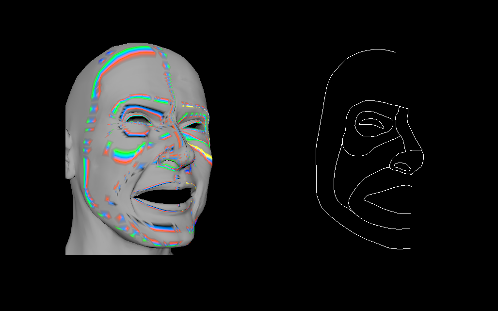

---
title:  Junheng Fang
subtitle : Report of Implementation on ODE-based C2 Continuous Surface Creation Technique
summary:  This project implements the ODE-based C2 continuous surface creation technique to recreate two models in the same topology with different expressions. Besides, it blends the surface creation method with geometric and physics-based skin deformation approaches to show,
(1)the advantages of the ODE-based surface creation technique,(2)the more realistic result of physics-based skin deformation approach,(3)the feasibility of blending this two approaches together.
type : docs # leave
date: "2020-08-14T12:00:00Z" # leave

tags: [MSc CAVE Project,2020, Surface Creation, ODE, skin deformation] # add some searchable keywords about your project 
# leave this bit it's for the menus.
menu :
  MScProject :
    parent : 2020
    weight : 20
--- 

[thesis link](https://github.com/leonsylarfang/Master-Project/blob/master/Report_of_Implementation_on_ODE_based_C2_Continuous_Surface_Creation_Technique.pdf)

[github link](https://github.com/leonsylarfang/Master-Project)

Thesis [Report of Implementation on ODE-based C2 Continuous Surface Creation Technique](Report_of_Implementation_on_ODE_based_C2_Continuous_Surface_Creation_Technique.pdf)

[comment]: <> (To add an image, use the standard markdown tags, try and scale them appropriatly)

[result video]: <iframe src="https://player.vimeo.com/video/450784864" width="640" height="564" frameborder="0" allow="autoplay; fullscreen" allowfullscreen></iframe>



